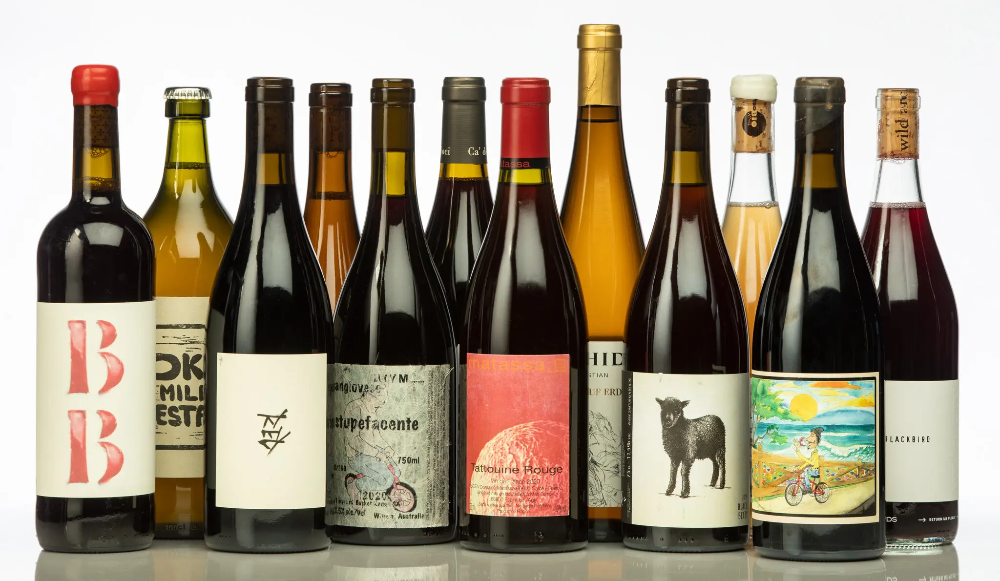

## Background

* The Wine Market's Complexity

The wine market is a dynamic, diversified sector of the economy where a number of factors affect how prices are formed. Historically, wine quality—which is frequently expressed in ratings—has been seen by both producers and customers as the main factor influencing pricing. But according to studies on consumer behavior and current market trends, wine pricing is significantly more intricate.

* Above and Beyond Quality Ratings

Although quality ratings have a considerable impact on wine pricing, several other factors are also quite important. Pricing may be greatly impacted by a number of factors, including vintage, manufacturing area, and brand repute.
